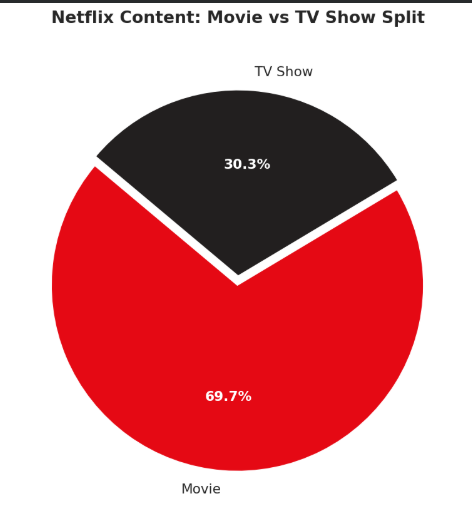
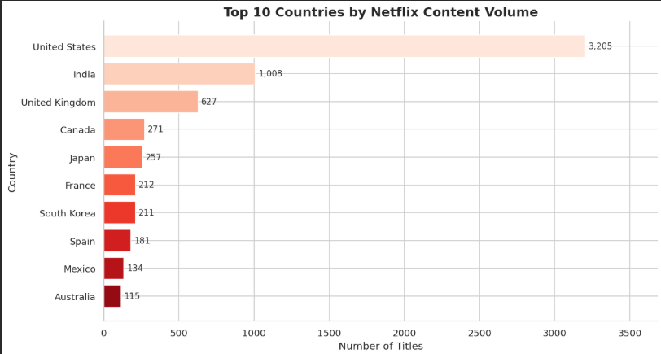
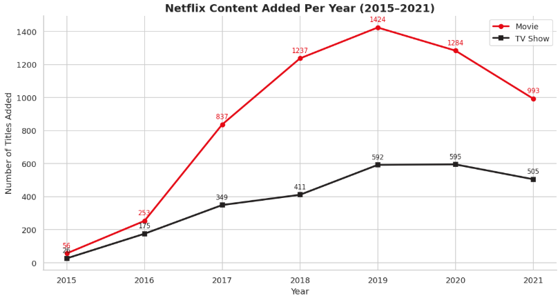
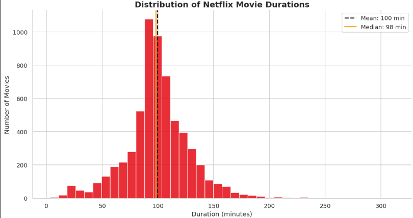
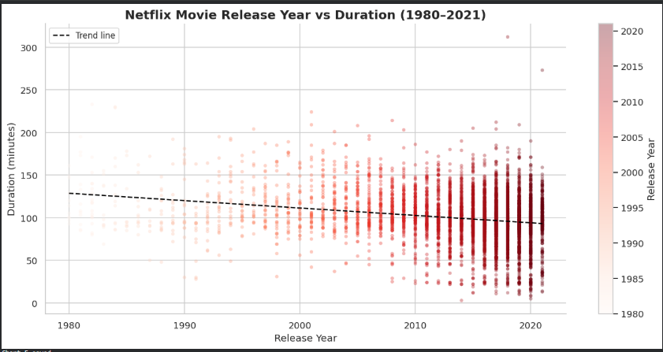
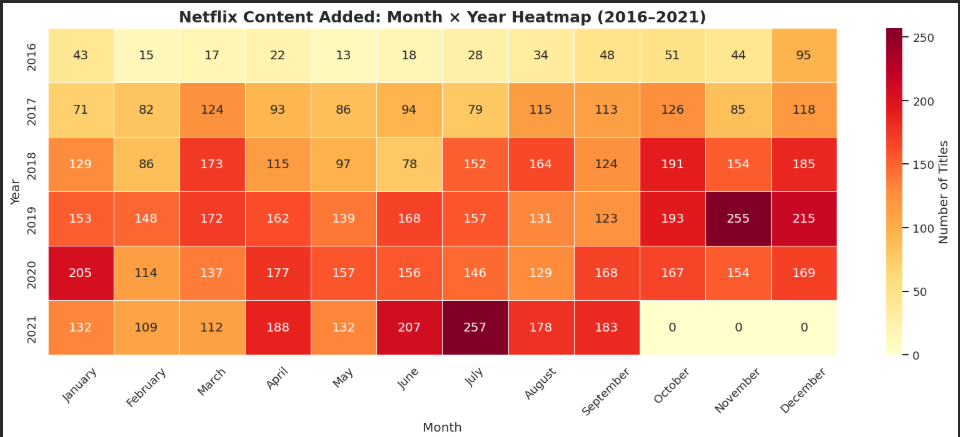
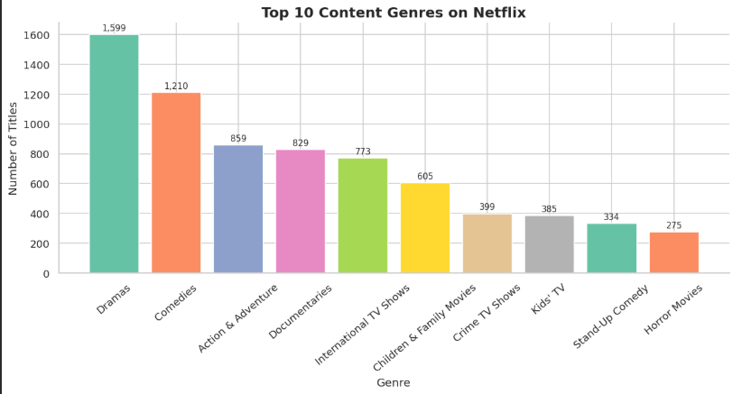

# EDA-Insights-Report

# 🎬 Netflix Content EDA

An Exploratory Data Analysis (EDA) project on the Netflix Titles dataset using Python. This project focuses on cleaning, analyzing, and visualizing Netflix content data to uncover trends, patterns, and business insights.

---

## 📌 Project Overview

Netflix hosts thousands of movies and TV shows from around the world. This project explores the Netflix dataset to understand content distribution, country-wise production trends, genre popularity, content growth over time, and movie duration patterns.

The project follows a complete EDA workflow including:

- Data Loading
- Data Cleaning
- Data Preprocessing
- Data Analysis
- Data Visualization
- Business Insights

---

## 🎯 Objectives

- Analyze the distribution of Movies and TV Shows.
- Identify the top content-producing countries.
- Examine Netflix's content growth over the years.
- Study movie duration patterns.
- Explore popular genres.
- Generate business insights using data visualization.

---

## 🛠️ Tech Stack

- Python 3.x
- Pandas
- NumPy
- Matplotlib
- Seaborn
- Jupyter Notebook

---

## 📂 Project Structure

```text
Netflix-Content-EDA/
│
├── PlutoAcademy_Project01_EDA_Netflix.ipynb
├── netflix_titles.csv
├── netflix_cleaned.csv
├── assets/
│   ├── chart1_pie_type_split.png
│   ├── chart2_bar_top_countries.png
│   ├── chart3_line_yearly_content.png
│   ├── chart4_histogram_duration.png
│   ├── chart5_scatter_year_duration.png
│   ├── chart6_heatmap_monthly.png
│   └── chart7_bar_genres.png
│
└── README.md
```

---

## ⚙️ Installation

### Clone the Repository

```bash
git clone https://github.com/Asmi-1056/EDA-Insights-Report.git
cd EDA-Insights-Report
```

### Install Required Libraries

```bash
pip install pandas numpy matplotlib seaborn
```

### Run the Project

```bash
jupyter notebook PlutoAcademy_Project01_EDA_Netflix.ipynb
```

---

## 📊 Visualizations

### 1. Movie vs TV Show Split

Shows the percentage distribution of Movies and TV Shows available on Netflix.



---

### 2. Top 10 Countries by Content Volume

Displays the countries contributing the highest number of titles to Netflix.



---

### 3. Netflix Content Added Per Year

Illustrates Netflix's content growth over time.



---

### 4. Distribution of Movie Durations

Shows the spread of movie durations across the Netflix catalog.



---

### 5. Release Year vs Duration Analysis

Analyzes the relationship between movie release year and duration.



---

### 6. Monthly Content Addition Heatmap

Visualizes content additions across different months and years.



---

### 7. Top 10 Genres on Netflix

Highlights the most popular genres available on Netflix.



---

## 🔍 Key Findings

### 🎥 Movies Dominate Netflix

- Movies account for approximately 70% of Netflix's content.
- TV Shows make up the remaining 30%.

### 🌍 India is a Major Content Producer

- The United States leads in content production.
- India ranks second in total content volume.

### 📈 Rapid Growth Until 2019

- Netflix experienced significant content growth from 2015 to 2019.
- Growth slowed during 2020–2021.

### ⏱️ Most Movies are Between 80–120 Minutes

- The average movie duration is around 100 minutes.
- Most content falls within a viewer-friendly duration range.

### 🎭 Popular Genres

- Dramas
- Comedies
- Action & Adventure
- Documentaries
- International TV Shows

---

## 💡 Business Insights

### Insight 1
Netflix is primarily a movie-focused platform, indicating strong user demand for feature-length content.

### Insight 2
India's high content volume highlights the growing importance of regional and non-English entertainment.

### Insight 3
The platform's rapid expansion between 2015 and 2019 reflects aggressive content acquisition and production strategies.

### Insight 4
Most successful movies fall within the 90–110 minute range, suggesting an optimal viewing duration.

### Insight 5
Content additions peak around October, November, and January, indicating seasonal release strategies.

---

## 🚀 Future Enhancements

- Interactive Streamlit Dashboard
- Recommendation System
- Genre Trend Forecasting
- Machine Learning-Based Analysis
- Advanced Country-wise Insights

---

## 📚 Dataset

Netflix Movies and TV Shows Dataset
Source:  
https://www.kaggle.com/datasets/shivamb/netflix-shows

---

## ⭐ Support

If you found this project helpful, consider giving this repository a ⭐ on GitHub.
Your support is greatly appreciated!
